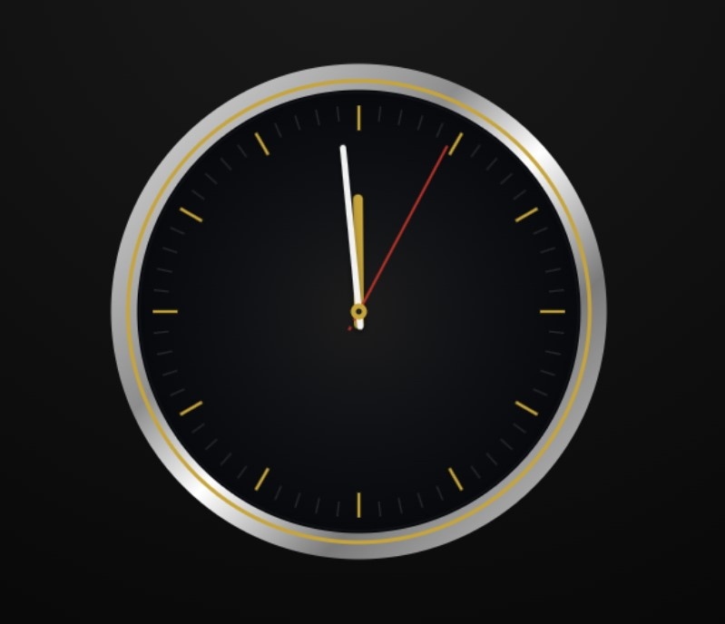

# Luxury Analog Clock

A canvas-based analog clock inspired by premium watch design.
Built with pure HTML5 Canvas and JavaScript, focusing on visual precision, smooth animation, and clean UI.

## Live Demo

https://NikolaPetrovic5ko.github.io/luxury-clock/

## Preview
<p align="center">
  
</p>

## Overview

This project recreates the look and feel of a luxury analog watch using the Canvas API.
The focus was on:

* accurate marker alignment
* balanced proportions
* smooth second-hand movement
* minimal, high-contrast design

## Features

* Smooth second hand (requestAnimationFrame)
* Custom-drawn dial and bezel
* Hour and minute markers with precise positioning
* Responsive scaling
* Lightweight (no libraries)

## Tech Stack

* HTML5
* CSS3
* JavaScript (Canvas API)

## Project Structure

```
luxury-clock/
├── index.html
```

## How to Run Locally

1. Clone the repository:

```
git clone https://github.com/NikolaPetrovic5ko/luxury-clock.git
```

2. Open `index.html` in your browser.

## Key Implementation Details

* Markers are rendered using calculated angles for precise alignment.
* Animation uses `requestAnimationFrame` for smoother motion compared to `setInterval`.
* Visual hierarchy is achieved through controlled line widths, spacing, and contrast.
* Canvas drawing avoids cumulative rotation errors by using absolute positioning.

## Future Improvements

* Add glass reflection / lighting effects
* Improve metallic bezel realism
* Add theme variations (dark / gold / steel)
* Convert into reusable component (React or Web Component)

## Author

Nikola Petrović

---
